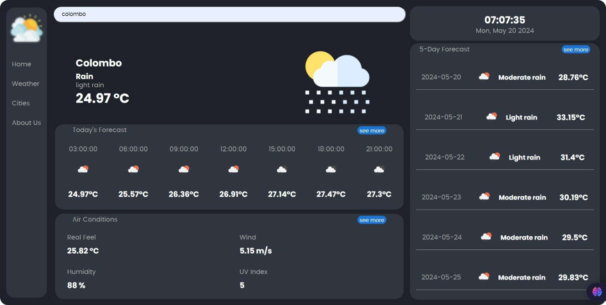

# Weather App

A sleek and informative weather application that provides current weather conditions, hourly forecasts, and a 5-day outlook for cities around the world.



## Features

- **Current Weather**: Displays the current temperature, weather condition, and an icon representing the weather.
- **City Search**: Allows users to search for weather information by city name.
- **Hourly Forecast**: Shows a 24-hour forecast with temperature and weather icons.
- **5-Day Forecast**: Provides a 5-day weather outlook with high temperatures and conditions.
- **Air Conditions**: Displays additional weather data including "Real Feel" temperature, wind speed, humidity, and UV index.
- **Responsive Design**: Clean, dark-themed interface that's easy to read and navigate.

## Technologies Used

- HTML5
- CSS3
- JavaScript (Vanilla)
- OpenWeather API

## Setup and Installation

1. Clone the repository:

   ```bash
   git clone https://github.com/yourusername/weather-app.git

   ```

2. Navigate to the project directory:

   ```bash
   cd weather-app
   ```

3. Open the index.html file in your web browser to run the application locally.
4. Obtain an API key from OpenWeather and replace the placeholder in the JavaScript file with your actual API key.

## Usage

1. Upon opening the app, you'll see the current weather for a default city (Colombo in the screenshot).
2. Use the search bar at the top to look up weather information for different cities.
3. The main display shows the current temperature, weather condition, and an icon.
4. Scroll down to see the hourly forecast for the next 24 hours.
5. The right sidebar displays a 5-day forecast with high temperatures and weather conditions.
6. Additional weather information like "Real Feel" temperature, wind speed, humidity, and UV index can be found in the "Air Conditions" section.

## Contributing

Contributions to improve the Weather App are welcome. Please follow these steps to contribute:

1. Fork the repository.
2. Create a new branch (git checkout -b feature/AmazingFeature).
3. Commit your changes (git commit -m 'Add some AmazingFeature').
4. Push to the branch (git push origin feature/AmazingFeature).
5. Open a Pull Request.

## License

This project is licensed under the MIT License - see the LICENSE.md file for details.
Acknowledgments
• Weather data provided by OpenWeather

## Contact

Your Name - your.email@example.com
Project Link: https://github.com/yourusername/weather-app
